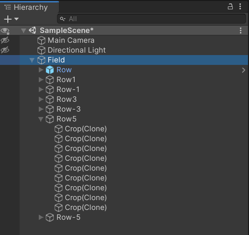
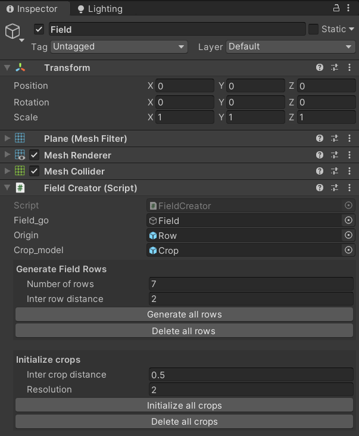

# BezierRowGenerator

Generator of crop rows shaped by Bezier curves. 

Based on Sebastian Lague's tutorial named "Curve Editor" (https://www.youtube.com/c/SebastianLague/).


## How to use the BezierRowGenerator ?
The code is structured around three objects :
* The ```Crop``` GameObject which is used to instantiate crops;
* The ```Path``` object which allows to instantiate and manipulate rows;
* The ```Field``` object that embedds the initialization of the rows and the instatiation of the crops;

In order to initialize a field:
1. Create a Plane object from the hierarchy panel, once added the correct components, it will represent the Field object and will be referenced later as the "Field game object". Attach the ```FieldCreator.cs``` script to it and drag-and-drop the plane into the 'Field_go' field (WARNING : Be careful that the plane is contained within the (X, Z) plane and that the orientation is the same as on the first figure, with the X-axis being vertical and the Z-axis being horizontal) (TODO: rendre le code plus robuste à ça).
2. Also create an Empty game object from the hierarchy panel and attach the 'PathCreator.cs' script to it ; this game object will be called from nom "Row game object". Drag-and-drop the Plane object into the field 'Field' in the Row inspector. Also define the three parameters which will be used to instantiate the path : coordinates of the initial and final points of the path, and the total number of anchor points which will be used to design the Bezier curve. Once created, the anchor and control points can be manipulated directly from the scene view, usign the mouse. The Row game object will be the original row based on which all the other rows will be created (by translating it, on one side and the other). In the hierarchy panel, set the Row game object as a child of the Field game object. In the Field object inspector panel, drag-and-drop the Row object into the "Origin" field.
3. Create a game object serving as a Prefab for all the crops that will be generated. Drag-and-drop it into the "Crop model" field, in the Field game object inspector.



4. Go in the Inspector of the Field game Object: declare the number of rows in the "Number of rows" field (WARNING: this number includes the original row). Also define the "Inter-row distance" in the dedicated field. When each parameter has been set properly, click the "Generate all rows" button to instatiate all the other rows. Those game objects should now appear in the hierarchy panel as children of the Field game object.
5. To initialize the crops, also set the "Inter-crop distance" (and optionnally the Resolution parameter) and press the "Intialize all crops" button to instantiate all the crops. They should now appear as children of their respective Row game object.



## Structure of the code
As told before, ```Crop```s are just a GameObject that is defined in the Scene view, no particular components are added. The ```Field``` and ```Path``` objects are built from respectively a Plane game object and an empty game object. The desired properties are then added using C# scripts, descibed below.

The ```Path``` and ```Field``` properties are defined within three scripts each:
1. A base script that defines the Object (```Path.cs``` and ```Field.cs```). The base classes doesn't inherit from ```MonoBehaviour```. The base script implements all the behaviour of the given object (e.g. move points in a row, get the coordinates of the vertices, etc.);
2. A creator script (```PathCreator.cs``` and ```FieldCreator.cs```) that implements all the functions called by the user to instantiate, keep track and manipulate a given object. Those classes inherit from ```MonoBehaviour```, because they are not instantiated but use the built-in Unity helper functions.
3. An editor scripts that implements all the GUI that allows the user to trigger the functions defined in the creator script.

As we can see, this three-layered structured allows a functional although well bundled code.

Two helper classes are provided : ```Bezier.cs``` that implements the Bezier interpolation formulas, and ```ExtensionMethods.cs``` that contains helper functions.
